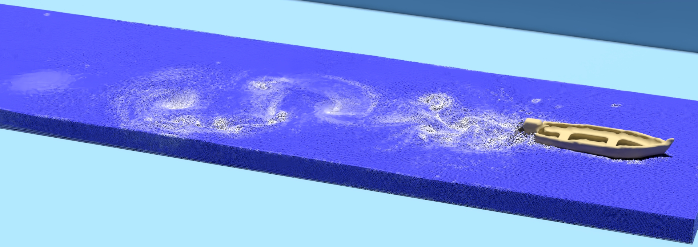

# Monte Carlo Vortical SPH for Simulating Turbulent Flows



## Abstract
In the context of vortex particle methods relying on SPH-based simulations, the direct approach of iterating all fluid particles to capture velocity from vorticity can lead to a significant computational overhead during the Biot-Savart summation process. To address this challenge, we present a Monte Carlo vortical smoothed particle hydrodynamics (MCVSPH) method for efficiently simulating turbulent flows within an SPH framework. Our approach harnesses a Monte Carlo estimator and operates exclusively within a pre-sampled particle subset, thus eliminating the need for costly global iterations over all fluid particles. Our algorithm is decoupled from various projection loops which enforce incompressibility, independently handles the recovery of turbulent details, and seamlessly integrates with most state-of-the-art SPH-based incompressibility solvers. Our approach rectifies the velocity of all fluid particles based on vorticity loss to respect the evolution of vorticity, effectively enforcing vortex motions. We demonstrate, by several experiments, that our MCVSPH method effectively preserves vorticity and generates visually prominent vortical motions.

## Installation and Run
Use Python's package installer pip to install Taichi Lang:
```
pip install taichi
```

To run this code:

```
python run_simulation.py --scene_file ./data/scenes/ball.json
```

```
python run_simulation.py --scene_file ./data/scenes/propeller.json
```

## Features
The following solvers have been implemented:
1. Monte Carlo Vortical SPH (MCVSPH)
2. Divergen-free SPH (DFSPH) [1]
3. Micropolar fluids SPH (MPSPH) [2]
4. Vorticity Refinement SPH (VRSPH) [3]

## Reference
1. Bender, J. and Koschier, D., 2016. Divergence-free SPH for incompressible and viscous fluids. IEEE Transactions on Visualization and Computer Graphics, 23(3), pp.1193-1206.
2. Bender, J., Koschier, D., Kugelstadt, T. and Weiler, M., 2018. Turbulent micropolar SPH fluids with foam. IEEE transactions on visualization and computer graphics, 25(6), pp.2284-2295.
3. Liu, S., Wang, X., Ban, X., Xu, Y., Zhou, J., Kosinka, J. and Telea, A.C., 2021, February. Turbulent details simulation for SPH fluids via vorticity refinement. In Computer Graphics Forum (Vol. 40, No. 1, pp. 54-67).


## Acknowledgement
Implementation of this paper is largely inspired by [SPH_Taichi](https://github.com/erizmr/SPH_Taichi).